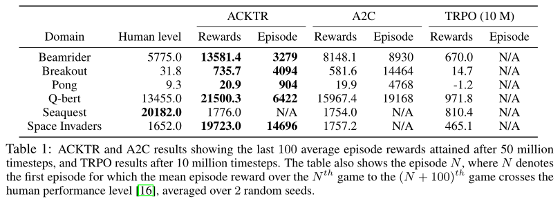

## Scalable trust-region method for deep reinforcement learning using Kronecker-factored approximation
learning using Kronecker-factored approximation
作者：Yuhuai Wu, Elman Mansimov, Roger B. Grosse, Shun Liao, Jimmy Ba
作者单位：University of Toronto Vector Institute，New York University
论文发表来源：Advances in Neural Information Processing Systems 30 (NIPS 2017)
论文发表时间：2017
论文查看网址：https://proceedings.neurips.cc/paper/2017/hash/361440528766bbaaaa1901845cf4152b-Abstract.html
论文贡献：本文扩展了自然政策梯度的框架，提出使用Kronecker因子近似曲率（K-FAC）与信任域来优化actor和critic，作者称该方法为使用Kronecker因子信任域的actor-critic（ACKTR）。作者认为，这是第一个用于actor-critic方法的可扩展信任域自然梯度方法。该方法可以学习连续控制中的非平凡任务，也直接从原始像素输入中学习离散控制策略。作者在Atari游戏的离散领域以及MuJoCo环境的连续领域中测试了该方法。与以前SOTA的actor-critic方法相比，本文的方法获得了更高的奖励，采样效率平均提高2-3倍。
论文代码库：https://github.com/openai/baselines

### Motivation(Why)
深度RL方法使用随机梯度下降(SGD)来训练控制策略。SGD和相关的一阶方法对空间的探索效率不高，交互时间比较长。自然梯度使用基于曲面的Fisher指标来做为度量梯度的最陡下降方向的指标。自然策略梯度难以精确计算梯度，需要对Fisher信息矩阵求逆。TRPO通过使用Fisher向量积避免了显示存储和对Fisher矩阵求逆。但是获取一步参数更新需要求多步共轭梯度，准确估计梯度需要每批都有大量样本。因此TRPO不适用于大模型，且样本效率很低。
Kronecker因子近似曲率(K-FAC)是一种可扩展的自然梯度近似。在监督学习中，它用更大的mini-batch，能加速各种最新的大规模神经网络的训练。与TRPO不同的是，每次更新成本与SGD相当，保持了曲率信息均值，允许使用小批量样本。由此表明，将K-FAC用于策略优化可以提高当前DRL方法的样本效率。
### Main idea(What)
本文介绍了一种使用Kronecker因子信任域方法的actor-critic方法(ACKTR)。该方法是针对actor-critic的可扩展信任域优化算法。该方法使用自然策略梯度的Kronecker因子，使得梯度的协方差矩阵能有效求逆。本文首次通过高斯-牛顿近似扩展自然策略梯度算法来优化值函数。
### How
#### 1.背景知识
##### 1.1 强化学习和actor-critic方法
我们考虑一个与无限视界贴现马尔科夫决策过程互动的agent为一个五元组 $(X, A, \gamma, P, r)$。agent的目标是最大化策略参数为$\theta$的折扣累积回报的期望$J(\theta)$。策略梯度方法直接参数化策略$\pi_{\theta}(a \mid s_{t}$，更新$\theta$以最大化目标$J(\theta)$。策略梯度的一般形式定义为：

其中$\psi^{t}$通常选用为优势函数$A^{\pi}(s_{t},a_{t})$。本文参考异步优势actor-critic(A3C)方法来定义优势函数如下：

其中 $V^{\pi}_{\phi}(s_{t})$是值网络，$V^{\pi}_{t}(s_{t})=E_{\pi}[R_{t}]$。为值网络的参数，本文通过更新TD，来最小化自举 $k$ 步回报 $\hat{R}_{t}$ 和预测值之间的平方差，$\frac {1}{2}\left \| \hat{r}_{t} - V^{\pi}_{\phi}(s_{t}) \right \|^{2}$.
##### 1.2 使用Kronecker因子近似的自然梯度
为了最小化非凸函数$J(\theta)$，用最陡下降法计算更新 $\nabla \theta$，最小化 $J(\theta + \nabla \theta)$。然而欧氏范数的变取决于参数 $\theta$，这是不合适的；因为模型的参数化是一个任意选择，不应该影响优化轨迹。自然梯度法利用Fisher信息矩阵$F$构造范数-KL散度的局部二次逼近。该范数独立于概率分布类上的模型参数 $\theta$，提供了更稳定更有效的更新。但是由于神经网络可能包含数百网格参数，计算和存储精确的Fisher矩阵及其逆是不切实际的，因此需要借助近似值。
Knonecker因子近似曲率技术使用Knonecker因子近似能对Fisher矩阵的执行有效的近似自然梯度更新。细节看如下原文:

这种近似可以解释为假设激活和反向传播导数的二阶统计量是不相关的。有了这个近似，自然梯度更新可以有效计算。
K-FAC近似自然梯度更新只需要对与w大小相当的矩阵进行计算。也有研究将K-FAC算法扩展到卷积网络及分布式网络，分布式K-FAC在训练大型现代分类卷积网络时速度提高了2-3倍。
#### 2. 方法
##### 2.1 actor-critic中的自然梯度
为了定义强化学习目标的Fisher度量，本文使用策略函数，定义了给定当前状态下的动作分布，并在轨迹分布上取期望:

描述一种应用自然梯度来优化critic的方法。学习critic可以被认为是一个最小二乘函数逼近问题，尽管这个问题的目标是移动的。在最小二乘函数逼近中，常用高斯-牛顿法，它将曲率近似高斯-牛顿矩阵 $G:=E[J^{T}J]$ ，其中 $J$ 是映射参数到输出的Jacobian矩阵。高斯-牛顿矩阵等价于高斯观测模型的Fisher矩阵。这种等价性使得我们可将K-FAC也应用到critic上。假设critic $v$的Fisher矩阵被定义为高斯分布$p(v\mid s_{t})\sim N(v;V(s_{t},\sigma^{2}))$。critic的Fisher矩阵是根据这个高斯输出分布定义的。 $\sigma$ 设为1，这就是普通高斯-牛顿法。
如果actor和critic是分离的，可用上面定义的指标分别应用K-FAC更新。我们可以通过假设两个输出分布的独立性来定义策略和价值分布的联合分布，即 $p(a,v\mid s)=\pi(a\mid s)p(v\mid s)$ ，并构建关于 $p(a,v\mid s)$ 的Fisher度量。它与标准的K-FAC没有区别，只是我们需要独立对网络输出进行采样。然后我们可应用K-FAC近似Fisher矩阵 $E_{p(\tau)}[\nabla log p(a,v|s)\nabla log p(a,v|s)^{T}]$，来进行同步更新。
此外，作者还采用正则化技术。作者执行Knonecker近似所需的二阶统计量和逆的异步计算，以减少计算时间。

##### 2.2 步长选择和信任域优化
采用传统的自然梯度更新会导致算法过早收敛到一个接近确定性的策略。本文采用K-FAC的信任域公式，选择有效步长 $\eta$ 为 
$$min(\eta_{max}, \sqrt{\frac{2\delta}{\nabla \theta^{T}\hat{F}\nabla \theta}})$$
其中学习率 $\eta$ 和信任域半径 $\delta$ 是超参数。如果actior和critic是分离的，这两个参数需要分别调参。
#### 3. 相关工作
自然梯度[1]由Kakade[10]首次应用于策略梯度方法。Bagnell和Schneider[3]进一步证明[10]中定义的度量是由路径分布流形推导出的协方差度量。Peters和Schaal[19]随后将自然梯度应用到actor-critic算法中。他们提出对actor的更新执行自然政策梯度，对critic的更新使用最小二乘时间差分(LSTD)方法。

然而，在应用自然梯度法时，有效存储Fisher矩阵和计算其逆存在着巨大的计算挑战。以前的工作限制了该方法使用兼容函数逼近器(线性函数逼近器)。为了避免计算负担，信任域策略优化(TRPO)[21]近似求解线性系统，使用共轭梯度和快速Fisher矩阵-向量乘积，类似于Martens[13]的工作。这种方法有两个主要缺点。首先，它需要重复计算Fisher向量积，不利于扩展到更大的架构，即用于从Atari和MuJoCo的图像观察中学习的实验。其次，它需要大量的rollout，以便准确估计曲率。

K-FAC通过使用易于处理的Fisher矩阵近似和在训练过程中保持曲率统计数据的运行平均值来避免这两个问题。尽管TRPO显示出比使用Adam[11]等一阶优化器训练的策略梯度方法更好的每次迭代进展，但它的样本效率通常较低。

几种提高TRPO计算效率的方法被陆续提出。为了避免重复计算Fisher向量乘积，Wang等人[27]用策略网和当前策略网的运行平均值之间的KL散度的线性近似来解决约束优化问题。Heess等[8]和Schulman等[23]在目标函数中添加KL代价作为软约束，而不是信任域优化器施加的硬约束。在连续和离散控制任务的样本效率方面，这两篇论文都显示了对普通策略梯度的一些改进。

最近还引入了其他actor-critic模型，通过引入经验重放[27]、[7]或辅助目标[9]来提高样本效率。这些方法与本文的工作是正交的，可以与ACKTR结合，进一步提高样本效率。
#### 4. 实验
本文进行了一系列实验来研究以下问题:
(1)在样本效率和计算效率方面，ACKTR与最先进的on-policy方法和常用的二阶优化器基线相比如何?
(2)什么是更好的临界优化范数?
(3)与一阶方法相比，ACKTR随批量规模缩放的性能如何?
作者在两个标准基准测试平台上评估了提出的方法ACKTR。
##### 4.1 离散控制
经过1000万时间步训练的6款Atari游戏的结果如图1所示，并与A2C和TRPO2进行比较。在所有游戏中，ACKTR在样本效率(即每时间步数的收敛速度)方面显著优于A2C。我们发现TRPO只能在1000万时间步内学习两款游戏，即《Seaquest》和《Pong》，并且在样本效率方面表现不如A2C。

表1是在六款Atari 2600游戏上对离散控制任务的实验评估数据。

##### 4.2 连续控制
作者在MuJoCo[中进行连续控制任务的模拟。由于高维动作空间和探索，连续控制任务有时更具挑战性。经过100万个时间步训练的8个MuJoCo环境的结果如图3所示。本文的模型在8个MuJoCo任务中的6个任务上显著优于基线，在其他两个任务(Walker2d和Swimmer)上与A2C具有竞争力。

#####  4.3 是一个优化critic的更好范式吗？
之前的自然策略梯度方法只对actor应用自然梯度更新。本文作者还建议对critic应用自然梯度更新。区别只在于选用什么范式来对critic进行最快的梯度下降;即2.2节中定义的范式 $\left \| \cdot \right \| _{B}$。此处将ACKTR应用于actor，并比较了使用一阶方法(即欧氏范数)和使用ACKTR(即高斯-牛顿定义的范数)进行临界优化。图5 (a)和(b)显示了连续控制任务《HalfCheetah》和雅达利游戏《Breakout》的结果。我们观察到，无论我们使用哪种范式来优化critic，与基线A2C相比，对actor应用ACKTR会带来改进。

然而，使用高斯-牛顿范数优化critic所带来的改进在训练结束时的样本效率和情景奖励方面更为显著。此外,高斯-牛顿范数也有助于稳定训练，因为我们观察到在带有欧氏范数的随机种子上的结果有更大的差异。作者发现自适应高斯-牛顿算法并没有比普通的高斯-牛顿算法提供任何显著的改进。
##### 4.4 ACKTR在挂钟时间上与A2C相比如何?
我们将ACKTR与基准A2C和TRPO进行了比较。表3显示了6款Atari游戏和8个MuJoCo(来自状态空间)环境下的平均每秒时间步数。

所得结果与之前的实验设置相同。注意，在MuJoCo中，任务片段是按顺序处理的，而在Atari环境中，片段是并行处理的;因此更多的帧是在Atari环境中处理的。从表中我们可以看到，ACKTR每个时间步最多只增加25%的计算时间，证明了它的实用性和很大的优化效益。
##### 5.5 ACKTR和A2C在不同批处理大小下的表现如何?
我们比较ACKTR和基线A2C在不同批处理大小下的表现。我们试验了160和640的批次大小。图5 (c)显示了以时间步数表示的奖励。

我们发现，批次大小较大的ACKTR与批次大小较小的ACKTR表现一样好。但是，随着批量的增加，A2C的样本效率下降明显。这与图5 (d)中的观察结果相对应，在图5 (d)中，我们根据更新次数绘制了训练曲线。我们发现，与使用A2C相比，使用更大批处理的ACKTR的好处大大增加。这表明，在分布式设置中，ACKTR有很大的加速潜力，在这种情况下，需要使用大的mini-batch。
#### 5. 结论
本文提出了一个用于深度强化学习的样本效率高且计算成本低的信任域优化方法。作者使用一种称为K-FAC的技术来近似actor-critic方法的自然梯度更新，并对稳定性进行信任域优化。本文第一个提出使用自然梯度更新优化actor-critic。作者在Atari游戏和MuJoCo环境中测试了ACKTR方法，观察到与一阶梯度方法(A2C)和迭代二阶方法(TRPO)相比，样本效率平均提高了2到3倍。由于本文算法的可扩展性，该方法也是第一个直接从原始像素观测空间的连续控制中的训练几个非平凡任务的技术。

总结：本文针对TRPO样本效率不高，不易扩展的问题，结合自然策略梯度kronecker因子近似技术，提出了带有信任域的knonecker因子近似技术，用于优化actor-critic方法。本文方法通过离散控制和连续控制实验表明，明显提高了样本效率和可扩展性。

#### 6. 个人简介

汪莉娟：天津大学研究生，专业方向为控制科学与工程，主要研究方向为交通优化与智能控制。